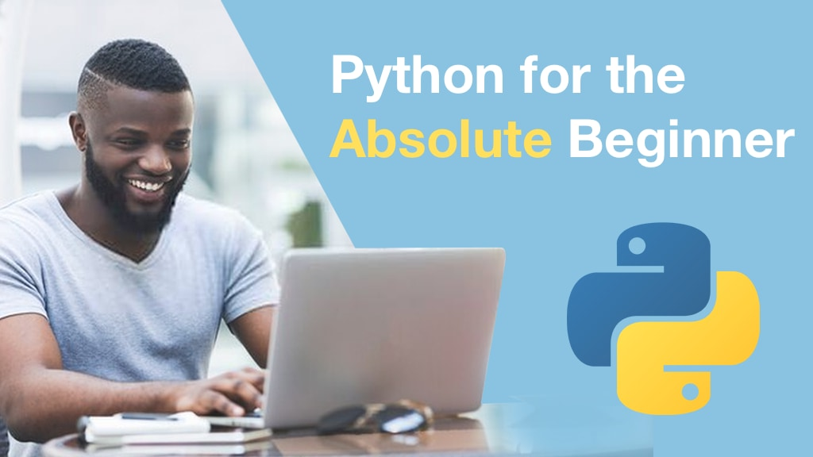
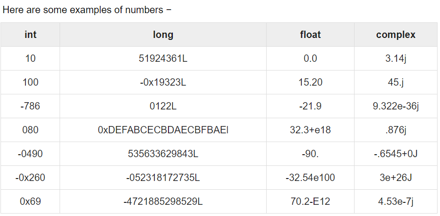
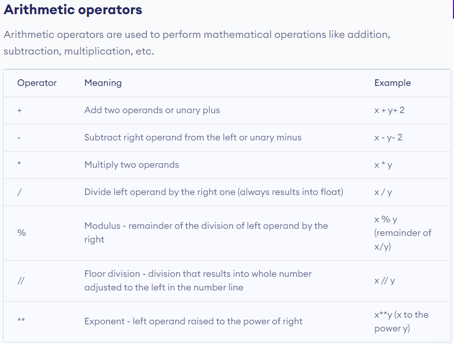
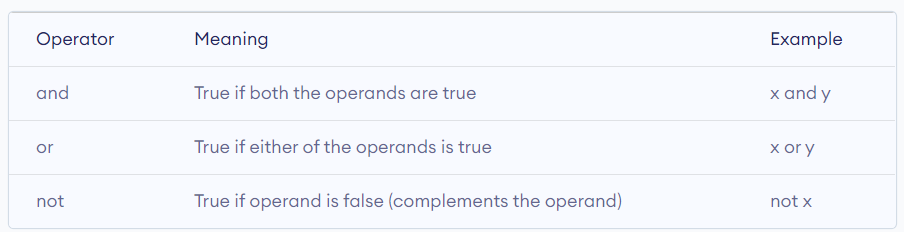
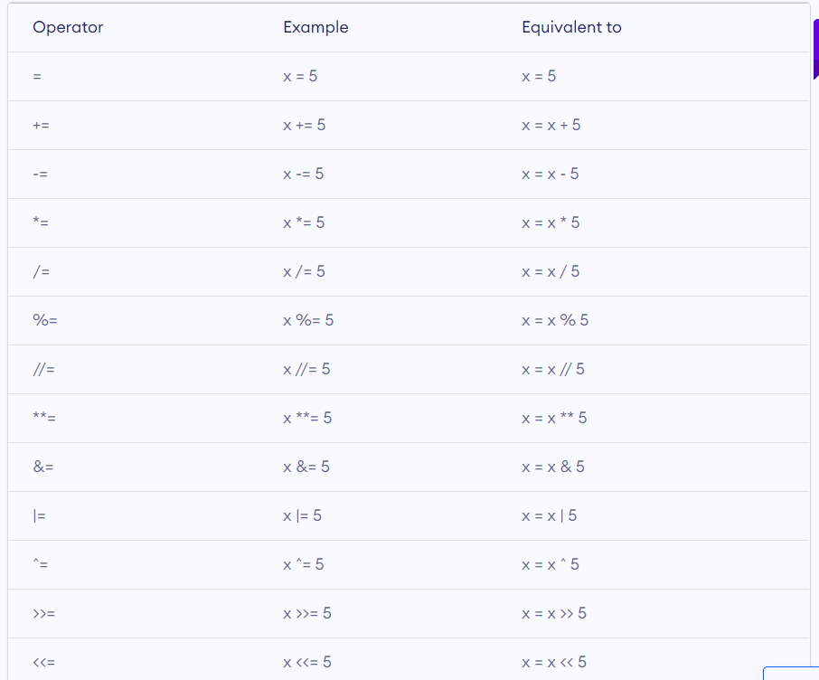
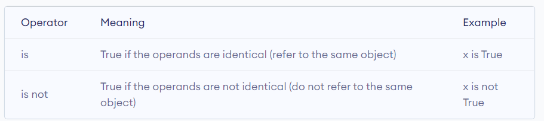
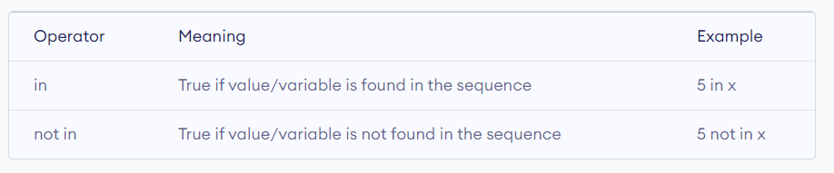
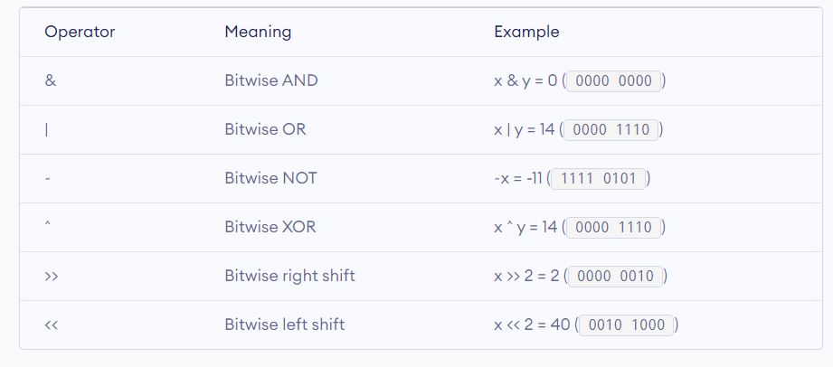

Python for Beginners Course

1. About Python:** 

​    Python is a widely used general-purpose, high-level programming language. It was initially designed by Guido van Rossum in 1991 and developed by Python Software Foundation. It was mainly developed for emphasis on code readability, and its syntax allows programmers to express concepts in fewer lines of code

**2.PEP naming conventions:**

​    A naming convention is a convention (generally agreed scheme) for naming things. Conventions differ in their intents, which may include to: Allow useful information to be deduced from the names based on regularities.

**Variable**: Use a lowercase single letter, word, or words. Separate words with underscores to improve readability. 

​	**example**: y , variable , my_variable

**Class**: Start each word with a capital letter. Do not separate words with underscores. This style is called camel case.

​	**example**: Model , MyClass

**3. Indentations:**
	Indentation refers to the spaces at the beginning of a code line. Where in other programming languages the indentation in code is for readability only, the indentation in Python is very important. Python uses indentation to indicate a block of code.

**4. Data types and variables:**	Refer /parctices/variables.py for more exercises: 

Variables are nothing but reserved memory locations to store values. This means that when you create a variable you reserve some space in memory. Based on the data type of a variable, the interpreter allocates memory and decides what can be stored in the reserved memory.

**Python has five standard data types**:
**Numbers :** Number data types store numeric values. Number objects are created when you assign a value to them.
**String**: Strings in Python are identified as a contiguous set of characters represented in the quotation marks.

**List**: A list contains items separated by commas and enclosed within square brackets ([]).

**Tuple** : A tuple is another sequence data type that is similar to the list. A tuple consists of a number of values separated by commas. Unlike lists, however, tuples are enclosed within parentheses.

**Dictionary**: Python's dictionaries are kind of hash table type. 

**5. Receiving Inputs from users:**

​	**Example:** 

​		Name = input(“enter name: “)
​		Color = input(“enter favourite color: ”)
​		Print(“name” + Name + “ color is” + color)
​	**Formatted Strings:**	
​		msg = f'{person_name} likes {favourite_car} car'

**6. Type Conversion:**

**Example**

​		birth_year = input(“birth year: “)
​        age  = 2020 – birth_year // Error occurs because int and string using
​        age = 2020 – int(birth_year)
​        Print(age)

**7. Strings & String Methods:**

​	**Some of listed here:**

​        content = “Python for Beginners”
​        Print(len(content)
​        Print(upper(content)
​        Print(lower(content))
​        Print(content.find(‘n’))
​        Print(content.replace(‘Be’, ‘BE’))
​        Print(‘Python’ in content)

**8. Operators:** 

Operators are special symbols in Python that carry out arithmetic or logical computation. The value that the operator operates on is called the operand.

1 + 2 => Here, + is the operator that performs addition. 1 and 2 are the operands and 3 is the output of the operation.

Python divides the operators in the following groups:

**Arithmetic operators:** Arithmetic operators are used to perform mathematical operations like addition, subtraction, multiplication, etc.

**Note**: Refer /practices/operators.py for more exercises

**Comparison operators :** Comparison operators are used to compare values. It returns either True or False according to the condition.
**Note**: Refer practices/operators.py for more exercises

**Logical operators:** Logical operators are the and, or, not operators.

**Note**: Refer /practices/operators.py for more exercises

**Assignment operators :** Assignment operators are used in Python to assign values to variables.

**Identity operators:** "is" and "is not" are the identity operators in Python.

**Membership operators:** in and not in are the membership operators in Python. They are used to test whether a value or variable is found in a sequence (string, list, tuple, set and dictionary).

**Bitwise operators:** Bitwise operators act on operands as if they were strings of binary digits. They operate bit by bit, hence the name.

**9. Loops:**

​    **While loops** - Refer /practices/while_loop.py for more exercises

​	**For Loops** - Refer /practices/for_loop.py for more exercises

​	**Nested Loops** - Refer /practices/nested_loop.py for more exercises

**10. Lists** - Refer /practices/practices/lists.py for more exercises

Lists are great to use when you want to work with many related values. They enable you to keep data together that belongs together, condense your code, and perform the same methods and operations on multiple values at once.

​	Lists are used to store an ordered collection of items.

​	Lists are mutable

​	Lists Can have duplicates

​	Lists Can access using index Create using[]

​	Lists Can have different data types data

​	Can compare the lists 

**Some of List Methods are:**

​	append() - Adds an element at the end

​	clear() - Removes all the elements from the list

​	copy() - Returns a copy of the list

​	count() - Returns the number of elements with the specified value

​	extend() - add element of a list

​	index() - Returns the index of the first element with the specified value

​	insert() - adds an element at the specified position

​	pop() - Removes the element at the specified position

​	remove() - Removes the item with the specified value

​	reverse() - Reverses the order of the list

​	sort() - sort the list

**11.Tuples** -  Refer /practices/practices/tuples.py for more exercises

Tuples are used to group together related data, such as a name, their age, and their gender etc.,.

​	Tuples are immutable

​	Cannot remove, insert values to tuples as they are immutable

​	Even though tuples are immutable, its list elements is **mutable**

​	Can be access using index

​	Can be store any types of data

​	Can unpack sequences

​	It allows duplicates

​	Use parentheses to create tuples

**12.Dictionaries**

A dictionary is a collection which is unordered

changeable and  indexed

Use curly {} braces

Have key and values

a dictionary key must be immutable and unique

**DICTIONARY METHODS**

​	clear() - Removes all the elements from the dictionary

​	copy() - Returns a copy of the dictionary

​	fromkeys() - Returns a dictionary with the specified key and value

​	get() - Returns the value of the specified key

​	items() - Returns a list containing a tuple for each key value pair

​	keys() - Returns the list containing the dictionary keys

​	values() - Returns the list of all the values in the dictionary

​	pop() - Removes the element with specified key

​	popitem() - Removes the last inserted key-value pair

​	setdefault() - Returns the value of the specified key. If key doesnt exist insert the key, with the 	specified value

​	update() - updates the dictionary with the specified key-value pair

**13.SETS**

